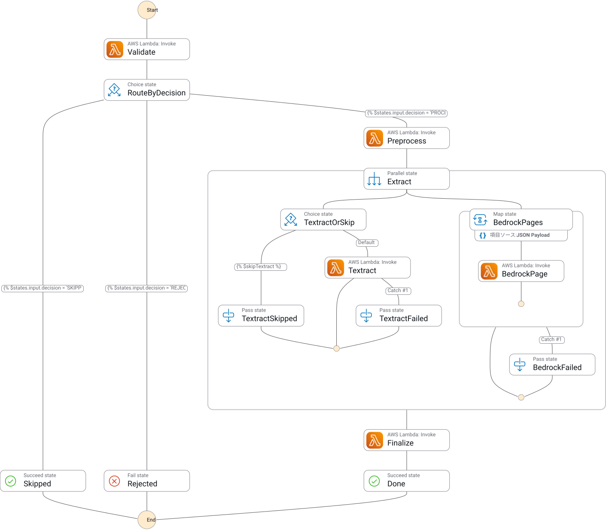

# folio

日本語: [README.ja.md](README.ja.md)

A document processing pipeline on AWS that converts research paper PDFs into structured JSON.

## Purpose

Papers are the test subject; the real target is internal organizational documents such as design decision records and incident reports.
Papers were chosen because ground truth can be generated mechanically from LaTeX sources, which makes extraction accuracy measurable.

Phase 1 is complete when the outputs of the two extraction routes can be compared.

## Architecture


The diagram source is [images/architecture.drawio](images/architecture.drawio). Re-export the SVG whenever it changes.

An event-driven pipeline triggered by an S3 upload. Processing is asynchronous.

| Layer      | Responsibility                              | Services          |
| ---------- | ------------------------------------------- | ----------------- |
| Intake     | Receive the PDF and emit an event           | S3, EventBridge   |
| Control    | Ordering, branching, concurrency, retries   | Step Functions    |
| Processing | Execute each step                           | Lambda            |
| Extraction | Obtain text and structure from the document | Textract, Bedrock |
| Storage    | Intermediate data, job state, artifacts     | S3, DynamoDB      |

Control is separated from processing. Lambda handles individual steps only; ordering, branching, and retries are declared in Step Functions.

### Two extraction routes

The same PDF goes through two routes and the outputs are compared.
They run in **Parallel** rather than being selected by a Choice state, because the comparison itself is the goal.

| Aspect            | Route A                            | Route B                            |
| ----------------- | ---------------------------------- | ---------------------------------- |
| Division of work  | Textract reads, Bedrock interprets | Bedrock does both from page images |
| Table structure   | Preserved as rows and columns      | Easily lost                        |
| Two-column layout | Columns separated correctly        | Reading order can break            |
| Cost              | Cheap, priced per page             | Expensive, priced per token        |
| Japanese          | Not supported                      | Supported                          |
| Provenance        | Source coordinates retained        | Not retained                       |

Textract does not support Japanese, so Japanese PDFs only go through Route B.

### State machine



Exported from the Step Functions console (`dev-folio-pipeline`). The definition lives in [infra/modules/pipeline/definition.asl.json](../infra/modules/pipeline/definition.asl.json); re-export the graph after changing it.

The execution has three stages.

| Stage    | States                              | What happens                                                                                                                                            |
| -------- | ----------------------------------- | ------------------------------------------------------------------------------------------------------------------------------------------------------- |
| Intake   | `Validate` → `RouteByDecision`      | validator checks the PDF and idempotency. `PROCEED` continues; an already processed job ends at `Skipped` (Succeed), invalid input at `Rejected` (Fail) |
| Extract  | `Preprocess` → `Extract` (Parallel) | preprocessor renders page images and the text layer, then route A and route B run side by side                                                          |
| Finalize | `Finalize` → `Done`                 | finalizer normalizes and verifies both results and writes them to `outputs/` and DynamoDB                                                               |

The two branches of `Extract` fail independently.

- Route A: `TextractOrSkip` diverts Japanese PDFs (`skipTextract`) to `TextractSkipped` (Pass). `Textract` waits on the asynchronous Textract job with `.waitForTaskToken`; textract-parser, invoked by the completion notification, structures the output through Bedrock and returns the token
- Route B: `BedrockPages` (Map) invokes `BedrockPage` (bedrock-parser) per page with a concurrency of 5

Failures in either branch are caught and routed to `TextractFailed` / `BedrockFailed` (Pass), which carry the error in their output into `Finalize`.
One failed route does not stop the execution; only when both fail does finalizer return `NoResultError` and fail it. Comparison is the goal, so whichever result was obtained is kept.

### Lambda functions

| Function          | Responsibility                                       |
| ----------------- | ---------------------------------------------------- |
| `validator`       | Input validation and idempotency check               |
| `preprocessor`    | Rasterization and text layer extraction              |
| `textract-parser` | Route A. Structures Textract output through Bedrock  |
| `bedrock-parser`  | Route B. Sends page images to Bedrock (inside a Map) |
| `finalizer`       | Schema normalization, verification, persistence      |

Function names are derived by joining the path under `cmd/` with hyphens.
`cmd/pipeline/validator` becomes `dev-folio-pipeline-validator`.

Environment variables read by the functions (`internal/config`). `FOLIO_ENV` and `AWS_REGION` are read by every function.

| Variable                       | Read by                         | Purpose                                                 |
| ------------------------------ | ------------------------------- | ------------------------------------------------------- |
| `FOLIO_ENV`                    | all                             | Environment identifier (`dev` / `stg` / `prd`)          |
| `FOLIO_DOCUMENTS_BUCKET`       | all                             | S3 bucket name                                          |
| `FOLIO_JOBS_TABLE`             | validator, finalizer            | DynamoDB table name                                     |
| `FOLIO_BEDROCK_MODEL_ID`       | textract-parser, bedrock-parser | Model ID used for structuring                           |
| `FOLIO_TEXTRACT_SNS_TOPIC_ARN` | textract-parser                 | Textract completion notification topic                  |
| `FOLIO_TEXTRACT_ROLE_ARN`      | textract-parser                 | Role Textract assumes to publish to SNS                 |
| `FOLIO_TEXTRACT_FEATURE_TYPES` | textract-parser (optional)      | FeatureTypes, comma-separated (default `LAYOUT,TABLES`) |
| `FOLIO_CROSSREF_MAILTO`        | finalizer (optional)            | Contact address for the Crossref polite pool            |

### S3 key layout

Roles are separated by prefix within a single bucket.

```text
{bucket}/
├── uploads/{jobId}/
│   └── original.pdf            Received PDF. Event trigger point
├── work/{jobId}/
│   ├── pages/
│   │   └── page-NNNN.png       Rasterized pages
│   ├── text/
│   │   └── layer.txt           Extracted text layer
│   ├── textract/
│   │   ├── raw.json            Raw Textract output
│   │   ├── callback.json       Data needed to answer the Textract completion notification (task token etc.)
│   │   └── document.json       Route A structured result before normalization (read by the finalizer)
│   └── bedrock/
│       └── page-NNNN.json      Per-page extraction result of Route B
└── outputs/{jobId}/
    ├── result-textract.json    Route A result
    ├── result-bedrock.json     Route B result
    └── comparison.json         Diff and evaluation of both routes
```

Event notifications filter on both the `uploads/` prefix and the `.pdf` suffix.
Without this, writes to `work/` or `outputs/` retrigger the pipeline and cause an infinite loop.

`jobId` is derived from the file hash, so re-uploading the same file maps to the same `jobId` and fits the idempotency check naturally.

## Directory layout

```text
folio/
├── backend/                Single Go module (github.com/tamaco489/folio/backend; see backend/README.md)
│   ├── cmd/pipeline/       validator, preprocessor, textract-parser, bedrock-parser, finalizer (main.go only wires dependencies)
│   ├── internal/
│   │   ├── config/         Shared — environment variable loading and validation
│   │   ├── domain/         Shared — structured JSON schema
│   │   ├── awsx/           Shared — s3, dynamo, sfn, textract, bedrock (SDK wrappers; fakes in s3test, dynamotest)
│   │   └── pipeline/       Lambda logic: validate, preprocess, textractparser, bedrockparser, finalize
│   │                       Pure logic: pdf, extract (textractroute, bedrockroute), normalize, verify (crossref)
│   ├── tools/              fetch-corpus (fetches evaluation papers from arXiv); build-truth, evaluate (Phase 2, not implemented yet). Not deployed
│   ├── testdata/           Recorded responses under textract/ and bedrock/ (Crossref recordings live in internal/pipeline/verify/testdata/)
│   ├── layers/             Lambda Layer build definitions (Dockerfile + build.sh)
│   ├── scripts/            Shell scripts behind the justfile recipes (cmds, build, package, clean)
│   ├── justfile            Recipe declarations only; each recipe calls a script or a single command
│   ├── .golangci.yml
│   └── go.mod
└── infra/                  Terraform (see infra/README.md)
    ├── modules/            storage, iam, compute, pipeline, messaging (all wired into envs/dev)
    ├── envs/dev/           dev environment: provider, backend, variables, module calls (stg and prd are out of scope for Phase 1)
    └── justfile
```

Under `internal/pipeline/`, `validate` `preprocess` `textractparser` `bedrockparser` `finalize` correspond one-to-one to the Lambda functions and own the S3 / DynamoDB access.
`pdf` `extract` `normalize` `verify` are pure logic that never touch S3: preprocessing, extraction, schema normalization, and verification.
The API server (`cmd/api/`) is out of scope for Phase 1 and does not exist yet.

## Toolchain

Managed with [asdf](https://asdf-vm.com/) and pinned in `.tool-versions` at the repository root.

```text
golang        1.26.5
terraform     1.15.8
golangci-lint 2.12.2
```

`golangci-lint` is pinned in two places, `.tool-versions` for local runs and `version:` of the golangci-lint Action in CI. Bump both together.

## Commands

The task runner is [just](https://github.com/casey/just), not Make.
Justfiles live directly under `backend/` and `infra/` rather than at the root, so change into the directory first.

```sh
cd backend && just test      # Go tests. lint / build / package etc.: backend/README.md
cd infra && just plan        # Terraform plan. init / validate / apply etc.: infra/README.md
```

Run `just --list` for the recipes; details and prerequisites are in [backend/README.md](../backend/README.md) and [infra/README.md](../infra/README.md).
The justfiles hold no shell logic; recipes that need more than a single command call a script under `scripts/`.

## Constraints

| Constraint             | Detail                                  | Mitigation                               |
| ---------------------- | --------------------------------------- | ---------------------------------------- |
| Payload limit          | 256KB between Step Functions states     | Keep data in S3, pass only keys          |
| Synchronous page limit | Textract sync processing handles 1 page | Async API with SNS completion callback   |
| Async limits           | 500MB and 3,000 pages per PDF           | Reject in the validation layer           |
| Language support       | Textract does not support Japanese      | Route Japanese through Route B only      |
| Throttling             | Bedrock limits concurrent invocations   | `MaxConcurrency` and exponential backoff |
| Lambda timeout         | 15 minutes maximum                      | Wait on the Step Functions side          |
| Protected PDFs         | Cannot be processed by Textract         | Reject in the validation layer           |

## Phase 1 comparison report

The results of running five English papers through both routes (timing, cost, output differences, confidence, problems encountered) are in [phase1-経路比較/00_目次.html](phase1-経路比較/00_目次.html) (Japanese, HTML). Open it in a browser; GitHub shows HTML files as source.

## Evaluation corpus

Papers from arXiv `cs.CL` and `cs.LG`, 8 to 20 pages, with LaTeX sources available.

The arXiv default license does not permit redistribution, so neither the PDFs nor the extraction results can be redistributed.
`backend/testdata/pdf/` is excluded from git and populated by `tools/fetch-corpus`.
