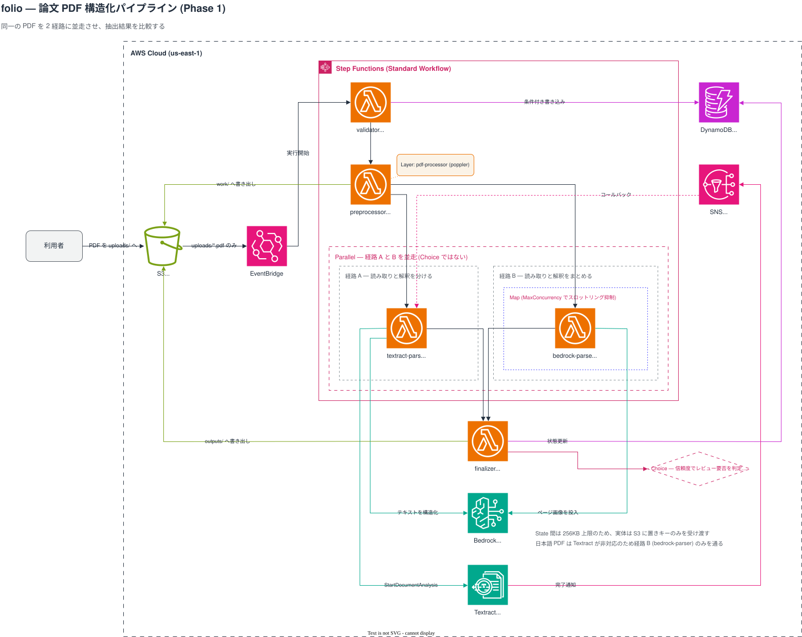

# folio

日本語: [README.ja.md](README.ja.md)

A document processing pipeline on AWS that converts research paper PDFs into structured JSON.

## Purpose

Papers are the test subject; the real target is internal organizational documents such as design decision records and incident reports.
Papers were chosen because ground truth can be generated mechanically from LaTeX sources, which makes extraction accuracy measurable.

Phase 1 is complete when the outputs of the two extraction routes can be compared.

## Architecture



The diagram source is [images/architecture.drawio](images/architecture.drawio). Re-export the SVG whenever it changes.

An event-driven pipeline triggered by an S3 upload. Processing is asynchronous.

| Layer      | Responsibility                              | Services          |
| ---------- | ------------------------------------------- | ----------------- |
| Intake     | Receive the PDF and emit an event           | S3, EventBridge   |
| Control    | Ordering, branching, concurrency, retries   | Step Functions    |
| Processing | Execute each step                           | Lambda            |
| Extraction | Obtain text and structure from the document | Textract, Bedrock |
| Storage    | Intermediate data, job state, artifacts     | S3, DynamoDB      |

Control is separated from processing. Lambda handles individual steps only; ordering, branching, and retries are declared in Step Functions.

### Two extraction routes

The same PDF goes through two routes and the outputs are compared.
They run in **Parallel** rather than being selected by a Choice state, because the comparison itself is the goal.

| Aspect            | Route A                            | Route B                            |
| ----------------- | ---------------------------------- | ---------------------------------- |
| Division of work  | Textract reads, Bedrock interprets | Bedrock does both from page images |
| Table structure   | Preserved as rows and columns      | Easily lost                        |
| Two-column layout | Columns separated correctly        | Reading order can break            |
| Cost              | Cheap, priced per page             | Expensive, priced per token        |
| Japanese          | Not supported                      | Supported                          |
| Provenance        | Source coordinates retained        | Not retained                       |

Textract does not support Japanese, so Japanese PDFs only go through Route B.

### Lambda functions

| Function          | Responsibility                                       |
| ----------------- | ---------------------------------------------------- |
| `validator`       | Input validation and idempotency check               |
| `preprocessor`    | Rasterization and text layer extraction              |
| `textract-parser` | Route A. Structures Textract output through Bedrock  |
| `bedrock-parser`  | Route B. Sends page images to Bedrock (inside a Map) |
| `finalizer`       | Schema normalization, verification, persistence      |

Function names are derived by joining the path under `cmd/` with hyphens.
`cmd/pipeline/validator` becomes `dev-folio-pipeline-validator`.

### S3 key layout

Roles are separated by prefix within a single bucket.

```text
uploads/{jobId}/original.pdf          Received PDF. Event trigger point
work/{jobId}/pages/page-NNNN.png      Rasterized pages
work/{jobId}/textract/raw.json        Raw Textract output
work/{jobId}/textract/callback.json   Data needed to answer the Textract completion notification (task token etc.)
work/{jobId}/textract/document.json   Route A structured result before normalization (read by the finalizer)
work/{jobId}/bedrock/page-NNNN.json   Per-page extraction result of Route B
work/{jobId}/text/layer.txt           Extracted text layer
outputs/{jobId}/result-textract.json  Route A result
outputs/{jobId}/result-bedrock.json   Route B result
outputs/{jobId}/comparison.json       Diff and evaluation of both routes
```

Event notifications filter on both the `uploads/` prefix and the `.pdf` suffix.
Without this, writes to `work/` or `outputs/` retrigger the pipeline and cause an infinite loop.

`jobId` is derived from the file hash, so re-uploading the same file maps to the same `jobId` and fits the idempotency check naturally.

## Directory layout

```text
folio/
├── backend/                Single Go module (github.com/tamaco489/folio/backend)
│   ├── cmd/
│   │   ├── pipeline/       validator, preprocessor, textract-parser, bedrock-parser, finalizer
│   │   └── api/            public, admin (out of scope for Phase 1)
│   ├── internal/
│   │   ├── config/         Shared — environment variable loading and validation
│   │   ├── domain/         Shared — structured JSON schema
│   │   ├── awsx/           Shared — s3, dynamo, textract, bedrock
│   │   ├── pipeline/       pdf, extract, normalize, verify
│   │   └── api/            router, middleware, public, admin (out of scope for Phase 1)
│   ├── tools/              fetch-corpus, build-truth, evaluate (not deployed)
│   ├── testdata/           Recorded responses under textract/ and bedrock/
│   ├── layers/             Lambda Layer build definitions (Dockerfile + build.sh)
│   ├── scripts/            Shell scripts behind the justfile recipes (cmds, build, package, clean)
│   ├── justfile            Recipe declarations only; each recipe calls a script or a single command
│   ├── .golangci.yml
│   └── go.mod
└── infra/                  Terraform
    ├── modules/            storage, messaging, compute, pipeline, iam
    ├── envs/               dev, stg, prd (separate directories, not workspaces)
    └── justfile
```

The four packages under `internal/pipeline/` map to Step Functions states:
`pdf` for preprocessing, `extract` for extraction, `normalize` for schema normalization, and `verify` for verification.

## Toolchain

Managed with [asdf](https://asdf-vm.com/) and pinned in `.tool-versions` at the repository root.

```text
golang        1.26.5
terraform     1.15.8
golangci-lint 2.12.2
```

`golangci-lint` is pinned in two places, `.tool-versions` for local runs and `version:` of the golangci-lint Action in CI. Bump both together.

## Commands

The task runner is [just](https://github.com/casey/just), not Make.
Justfiles live directly under `backend/` and `infra/` rather than at the root, so change into the directory first.

```sh
cd backend
just fmt              # go fmt ./...
just vet              # go vet ./...
just lint             # golangci-lint run ./... (config: .golangci.yml, same version as CI)
just test             # go test ./...
just fix-diff         # go fix -diff ./... (dry run)
just fix              # go fix ./...
just modernize        # gopls modernize analyzers, e.g. errorsastype (dry run)
just modernize-fix    # Apply the modernize suggestions
just cmds             # List build targets (scripts/cmds.sh)
just build            # Cross-compile all Lambda functions (scripts/build.sh)
just build-one <cmd>  # Build a single function (scripts/build.sh <cmd>, e.g. pipeline/validator)
just package          # Archive into bin/{function}.zip (scripts/package.sh, runs build first)
just clean            # Remove artifacts under bin/ (scripts/clean.sh)
```

The justfile holds no shell logic. Recipes that need more than a single command call a script under `scripts/`, so the scripts can be checked with shellcheck and run without just (they change into `backend/` themselves, so the current directory does not matter).

Build targets are discovered by searching for `main.go` under `cmd/`, so adding a Lambda function does not require editing the justfile or the scripts.

Builds target `provided.al2023` on `arm64` and output to `bin/{function}/bootstrap`.
The `provided` runtime requires the executable to be named `bootstrap`.

### Lambda Layer

The poppler native binaries are distributed as a Layer.

```sh
cd backend/layers/pdf-processor
./build.sh
```

See [backend/layers/pdf-processor/README.md](../backend/layers/pdf-processor/README.md) for details.

## CI

`.github/workflows/ci-backend.yml` runs on `pull_request` with two jobs, `golangci-lint` and `build-test`.

Actions are pinned to full-length commit SHAs, because tags can be moved.

CI cannot reach real AWS APIs.
`permissions` is limited to `contents: read` with no OIDC, and `AWS_EC2_METADATA_DISABLED=true` additionally blocks IMDS.

## Design documents

Naming conventions, architecture details, DynamoDB design, region selection, Lambda packaging strategy, Textract FeatureTypes selection, and corpus selection criteria live in the Develop database in Notion (parent page: AWS AIP-C01).

New design decisions are appended in ADR form: status, context, options, comparison, decision, rationale, consequences, and conditions for revisiting.

## Constraints

| Constraint             | Detail                                  | Mitigation                               |
| ---------------------- | --------------------------------------- | ---------------------------------------- |
| Payload limit          | 256KB between Step Functions states     | Keep data in S3, pass only keys          |
| Synchronous page limit | Textract sync processing handles 1 page | Async API with SNS completion callback   |
| Async limits           | 500MB and 3,000 pages per PDF           | Reject in the validation layer           |
| Language support       | Textract does not support Japanese      | Route Japanese through Route B only      |
| Throttling             | Bedrock limits concurrent invocations   | `MaxConcurrency` and exponential backoff |
| Lambda timeout         | 15 minutes maximum                      | Wait on the Step Functions side          |
| Protected PDFs         | Cannot be processed by Textract         | Reject in the validation layer           |

## Evaluation corpus

Papers from arXiv `cs.CL` and `cs.LG`, 8 to 20 pages, with LaTeX sources available.

The arXiv default license does not permit redistribution, so neither the PDFs nor the extraction results can be redistributed.
`backend/testdata/pdf/` is excluded from git and populated by `tools/fetch-corpus`.
